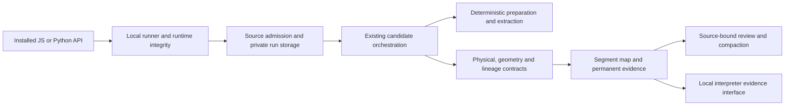

# Shared engine responsibilities

The library still uses the existing TypeScript orchestrator and Python image
engine. The September 2026 decomposition moves contracts and pure calculations
out of the orchestration paths; it does not replace the pipeline.

| Responsibility | Module |
| --- | --- |
| Numeric bounds, invertible transforms, predictable contract errors | `src/lib/digitizer/physical-contracts.ts` |
| Durable metadata and compatibility validation | `record-contracts.ts` |
| Source coordinate chains, source regions and calibration evidence | `geometry-evidence.ts` |
| Canonical/compact timing, support, polarity and immutable segments | `segment-evidence.ts` |
| Direct/fused/repaired interval contributors and affine alignment | `lineage.ts` |
| Shared model/preprocessing/calibration ancestry | `candidate-ancestry.ts` |
| Selector feature identity and profile compatibility | `selector-feature-identity.ts` |
| Permanent artifacts and historical evidence absence | `evidence-retention.ts` |
| Processing, output, eligibility, review and advisory quality | `outcome-dimensions.ts` |
| Read-only source/segment bundles and measurement references | `interpreter-evidence.ts` |
| Lead-local and page-semantic benchmark coordinates | `ecg_benchmark/coordinates.py` |
| Denominators, leakage checks and independent-group intervals | `ecg_benchmark/evaluation.py` |
| Existing probability-path algorithm | `ecg_pipeline/probability_path.py` |

Type-only run imports avoid introducing runtime cycles. The probability path
was extracted without changing its arithmetic, and its upstream attribution
and CC BY-SA scope follow it. `digitizer.ts` retains orchestration, candidate
planning and selection. `runs.ts` retains locking, atomic persistence, serving
and review. Further decomposition should proceed against the same frozen
equivalence contract, not as a broad rewrite.

The first installed comparison preserved all seven canonical CSVs exactly and
the eighth abstention. Subsequent comparisons bind source trees and package
payload hashes separately. Geometry/source metadata, interval lineage and
profiling fields intentionally change provenance bytes; waveform and policy
equivalence is assessed independently.
